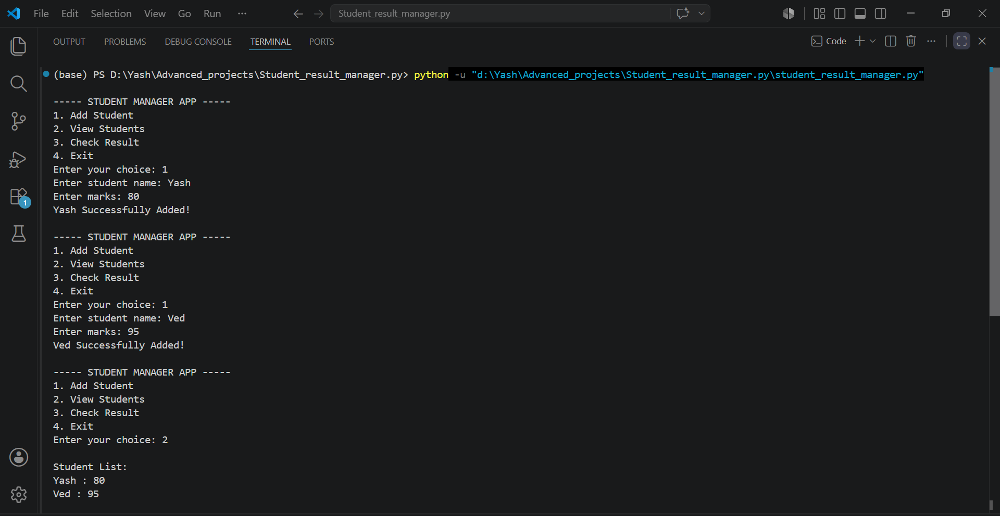
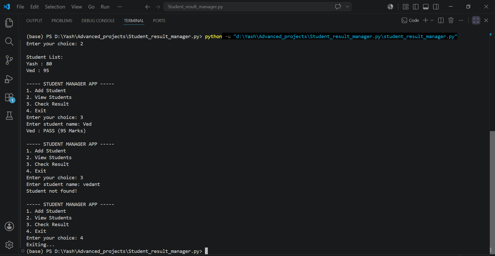

# 🎓 Student Manager App (Python)

A simple command-line **Student Manager Application** built using **Python**. This project allows users to manage student records by adding students, viewing all records, and checking whether a student has passed or failed based on their marks.

---

## 🚀 Features

- ➕ Add a new student
- 📋 View all student records
- ✅ Check student result (Pass/Fail)
- ❌ Handles invalid menu choices
- 🚪 Exit the application

---

## 🛠️ Technologies Used

- Python 3
- Dictionary
- While Loop
- Conditional Statements (`if-elif-else`)
- User Input
- Exception Handling

---

## 📸 Application Screenshots

### Student Manager App Output



### Student Result Output



---

## 📂 Project Structure

```text
Student-Manager-App/
│
├── student_manager.py
├── README.md
├── student_result.png
└── student_result2.png
```

---

## ▶️ How to Run

### 1. Clone the repository

```bash
git clone https://github.com/your-username/Student-Manager-App.git
```

### 2. Open the project folder

```bash
cd Student-Manager-App
```

### 3. Run the application

```bash
python student_manager.py
```

---

## 💻 Sample Menu

```text
----- STUDENT MANAGER APP -----

1. Add Student
2. View Students
3. Check Result
4. Exit

Enter your choice:
```

---

## 📚 Python Concepts Used

- Variables
- Dictionary
- While Loop
- If-Else Statements
- User Input
- Dictionary Operations
- Membership Operator (`in`)
- Loops
- Exception Handling

---

## 🔮 Future Improvements

- ✏️ Update Student Details
- ❌ Delete Student
- 🔍 Search Student
- 📊 Display Average Marks
- 🏆 Grade System (A, B, C, D, F)
- 💾 Save Data to CSV or File
- 🗄️ Connect with MySQL
- 🖥️ GUI using Tkinter
- 🌐 Web Version using Flask or Django

---

## 🎯 Learning Outcome

This project helped me understand:

- How to use Python dictionaries for data storage
- How to build menu-driven applications
- Taking user input and validating it
- Using loops and conditional statements
- Implementing basic CRUD-like operations
- Improving programming logic

---

## 👨‍💻 Author

**Yash Patil**

🎯 Aspiring Data Engineer  
💻 Learning Python, SQL, MongoDB & Data Engineering

---

## ⭐ Support

If you found this project helpful, please consider **starring ⭐ this repository**. Your support is appreciated!

---
**Thank you for visiting this repository! Happy Coding! 🚀**
